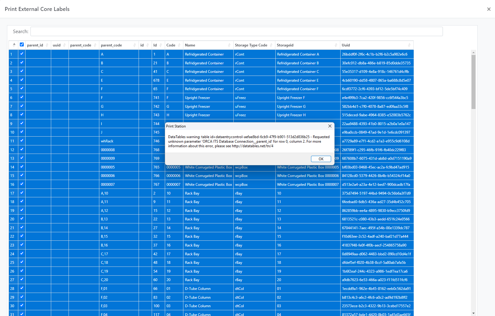
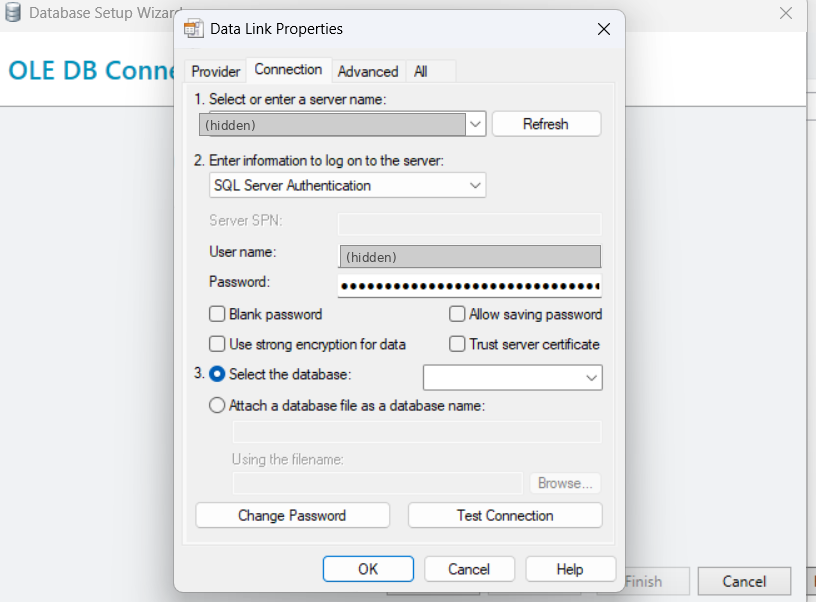
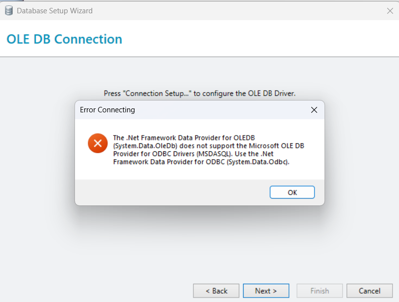
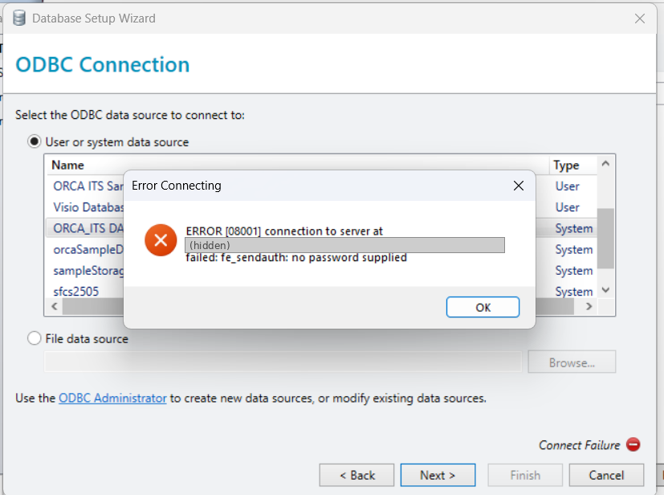

::: {.callout-note appearance="simple"}
**Who this is for:** anyone at ORCA who needs to print storage or core labels from the ORCA sample database. You do not need to know anything about databases. Follow the steps in order and do exactly what each step says.
:::

# What this SOP covers

Our BarTender label templates read their information (container names, rack bays, D-tube columns, barcodes and so on) straight from the ORCA sample database. This means you never type label text by hand: you pick the records you want from a list and BarTender prints them.

For this to work, your computer needs three things set up **once**:

1.  A small program (a *driver*) that lets Windows talk to the database.
2.  A *data source* that tells Windows where the database is.
3.  A copy of our shared *connection file*, which tells BarTender which data source to use.

After that, printing labels takes about a minute. The one-time setup is in @sec-setup and printing is in @sec-printing.

# Quick reference

| What | Where |
|------------------------|------------------------------------------------|
| The ORCA HCS share | Usually the **W:** drive. Ask  if you can't find it |
| Label templates (`.btw` files) | On the ORCA HCS share in `\OtagoLabels\orcaSampleDbLabels` |
| Shared connection file (`.xml`) | On the ORCA HCS share in `\OtagoLabels\orcaSampleDbLabels\databaseConnections` |
| SQL query used by the labels | On the ORCA HCS share in `\OtagoLabels\orcaSampleDbLabels\lanelSqlScript` |
| Database connection details and setup script | On the ORCA HCS share in `\OtagoLabels\dbSetup` |
| Where BarTender looks for connection files on your PC | `C:\ProgramData\Seagull\Database Connections` |
| Data source name (must be spelled exactly like this) | `` |
| BarTender connection name | `` |
| Database password | Ask . |

: Where everything lives

# Before you start

Check each of these. If any answer is "no", sort it out first.

- [ ] **BarTender is installed** on your computer. Click the Windows **Start** button and type `BarTender`. You should see *BarTender Designer* and *Print Station*. If not, ask IT to install it.
- [ ] **You can see the ORCA HCS share.** Open **File Explorer** (the yellow folder icon on the taskbar) and click **This PC**. You should see the ORCA share, usually as the **W:** drive. If you don't have it, ask  or IT to connect it.
- [ ] **You are on the university network**, either on campus or connected through the university VPN. The database cannot be reached from home without the VPN.
- [ ] **You know the database password**, or know who to ask ().
- [ ] **For the one-time setup only:** you can install software, or someone from IT is with you. Installing the driver usually needs administrator rights.

# One-time setup on your computer {#sec-setup}

Do this section **once per computer**. If labels already print correctly on your computer, skip to @sec-printing.

## Step 1: Install the PostgreSQL ODBC driver

The ORCA database is a *PostgreSQL* database. Windows needs a free driver called **psqlODBC** to talk to it.

1.  First check whether it is already installed. Click **Start**, type `ODBC`, and open **ODBC Data Sources (64-bit)**. Make sure it says **64-bit**; the 32-bit version will not work with BarTender.
2.  Click the **Drivers** tab. Look down the list for .
    - If it is there, close the window and go to Step 2.
    - If it is not there, carry on with this step.
3.  Ask IT to install the **psqlODBC 64-bit (x64)** driver, or, if you have administrator rights, download the latest `psqlodbc_x64.msi` from the official PostgreSQL website (<https://www.postgresql.org/ftp/odbc/releases/>) and double-click it. Accept all the default options.
4.  Open **ODBC Data Sources (64-bit)** again and check that  is now in the **Drivers** list.

::: callout-warning
Choose the **Unicode** driver and the **64-bit (x64)** version. The *ANSI* or 32-bit versions will appear to work but BarTender will not be able to see them.
:::

## Step 2: Create the data source {#sec-dsn}

A *data source* (Windows calls it a *DSN*) is a saved set of instructions for finding the database. The shared BarTender connection file looks for a data source with the exact name **``**, so the name must match letter for letter, including capitals and underscores.

1.  On the ORCA HCS share, open `\OtagoLabels\dbSetup\manualDbSetup.txt`. It lists the exact values to type in step 6. Keep it open.

2.  Click **Start**, type `ODBC`, and open **ODBC Data Sources (64-bit)**.

3.  Click the **System DSN** tab. (Not *User DSN*. A System DSN works for everyone who logs in to this computer.)

4.  If  is already in the list, select it, click **Configure...**, and check the settings against the table below. Otherwise click **Add...**.

5.  Choose  from the list and click **Finish**.

6.  A window called *PostgreSQL Unicode ODBC Driver (psqlODBC) Setup* opens. Fill it in exactly like this:

    | Box         | Type this                                       |
    |-------------|-------------------------------------------------|
    | Data Source | from `manualDbSetup.txt`                                      |
    | Description | `ORCA sample database (read only)`              |
    | Database    | from `manualDbSetup.txt`                                      |
    | Server      | from `manualDbSetup.txt`                                      |
    | Port        | from `manualDbSetup.txt`                                      |
    | User Name   | from `manualDbSetup.txt`                                      |
    | Password    | the database password (ask ) |
    | SSL Mode    | `require`                                       |

    : Data source settings

7.  Click **Test**. You should see **Connection successful**. If you get an error, check every box again for typing mistakes, then see @sec-troubleshooting.

8.  Click **Save**, then **OK** to close the ODBC window.

::: callout-important
The password **must** be saved in the data source. BarTender never asks for it, and if it is missing you will get the *"no password supplied"* error shown in @fig-nopw.
:::

### Quicker alternative: the setup script

If you have administrator rights on your computer, one script does Step 2 and Step 3 for you. It checks the driver is installed, asks for the password, creates the data source, tests it, and copies the connection file.

1.  On the ORCA HCS share, open the folder `OtagoLabels\dbSetup`.
2.  Right-click **powershellDbSetup.ps1** and choose **Run with PowerShell**.
3.  Windows asks *"Do you want to allow this app to make changes to your device?"* Click **Yes**. (If it asks for an administrator password, ask IT.)
4.  Type the database password when asked (nothing appears as you type) and press **Enter**.
5.  You should see **Connection successful** and **Connection file copied**. Press **Enter** to close the window, then go to Step 4.

## Step 3: Copy the shared connection file to your computer {#sec-copy-xml}

BarTender only looks for shared connection files in one folder on your own computer. We keep the master copy on the ORCA HCS share, so you copy it across.

1.  Open **File Explorer**, go to the ORCA HCS share, and open the folders `OtagoLabels` → `orcaSampleDbLabels` → `databaseConnections`.
2.  You will see one or more files ending in **`.xml`**. Select them all (click one, then press **Ctrl + A**) and press **Ctrl + C** to copy.
3.  Click in the address bar again, paste **`C:\ProgramData\Seagull\Database Connections`** and press **Enter**.
    - This folder is normally hidden, but typing the path into the address bar still takes you there.
    - If Windows says the folder does not exist, open BarTender Designer once and close it, then try again.
4.  Press **Ctrl + V** to paste. If Windows asks whether to replace existing files, choose **Replace the files in the destination**.
5.  If Windows asks for administrator permission, click **Continue** (or ask IT).
6.  **Close BarTender completely** if it is open, then open it again. BarTender only reads these files when it starts.

::: callout-tip
Whenever  tells you the connection has been updated, repeat this step to get the new copy.
:::

## Step 4: Check that it works

1.  Open **Print Station** (see @sec-printing) and open any label from `\OtagoLabels\orcaSampleDbLabels`.
2.  A list of records (containers, rack bays and so on) should appear with no error messages.

If you see the list, setup is finished. If you see an error, go to @sec-troubleshooting.

# Printing labels {#sec-printing}

## Open the labels folder in Print Station

*Print Station* is the simple printing window of BarTender. You cannot accidentally change a label design in it, so it is the recommended way to print.

1.  Click **Start**, type `Print Station`, and open **BarTender Print Station**.
2.  The first time, you need to point it at our labels folder. Use the folder selector at the top of the window, browse to `\OtagoLabels\orcaSampleDbLabels` on the ORCA HCS share, and select it. Print Station remembers this folder, so you only do this once.
3.  You will now see a tile for each label template (each `.btw` file).

## Choose and fill in the label

1.  Click the label you need, for example the external core label.
2.  A window opens with a list of records from the database (@fig-picker shows an example).

{#fig-picker width="100%"}

3.  **Clear all the ticks first.** When the window opens, *every* row is usually ticked, which would print a label for every item in the database. Click the tick box in the **header row** (top left, above the row numbers) so that all the ticks disappear.
4.  Type in the **Search** box to narrow down the list. For example, type `Rack Bay` to see only rack bays, or type a code such as `F,02` to find a particular D-tube column.
5.  Tick the box on each row you want a label for.
6.  Click **Print** (or **OK**, depending on the label).

## Print

1.  The print window opens. Check the **Printer** box shows the correct label printer.
2.  Check the **number of copies**. This is copies *per record*: 2 copies with 5 records ticked gives 10 labels.
3.  Click **Print**.
4.  Check the first label that comes out before walking away, especially the barcode and the text size.

::: callout-note
If you ignore a warning message that pops up while the list is loading (like the one in @fig-picker), labels may still print but with **blank fields**, such as a missing barcode. Report the warning rather than clicking through it.
:::

## Printing from BarTender Designer (alternative)

You can also open a `.btw` file directly in **BarTender Designer** (**File → Open**, then browse to `\OtagoLabels\orcaSampleDbLabels` on the ORCA HCS share) and click the **Print** button on the toolbar. The record list and print window are the same as above.

**Do not save** when you close Designer, unless you meant to change the label design (see @sec-files).

# Where to save files, and rules for everyone {#sec-files}

**Label templates (`.btw` files)**

: Lives in `\OtagoLabels\orcaSampleDbLabels`. Only label designers change them.

**Shared connection file (`.xml`), master copy**

: Lives in `\OtagoLabels\orcaSampleDbLabels\databaseConnections`. Only label designers change it.

**Your computer's copy of the connection file**

: Lives in `C:\ProgramData\Seagull\Database Connections`. Always copied from the ORCA HCS share, never edited by hand.

1.  **Always print from the shared folder.** Don't copy `.btw` files to your desktop or Documents. Local copies don't get updates and cause "it works on my computer" problems.
2.  **Don't save over a template** you only opened to print. If BarTender asks *"Do you want to save changes?"* after printing, choose **Don't Save**.
3.  **Don't rename or move** files in the shared folders. Other people's labels depend on the names.
4.  **New label designs** are saved in `\OtagoLabels\orcaSampleDbLabels` on the ORCA HCS share, with a clear name, for example `ExternalCoreLabel_50x25mm.btw`. Use no spaces if you can.
5.  **Never store the database password** in any file in these folders, in email, or in this document.

# For label designers {#sec-designers}

This section is only for the person who builds or maintains the label templates.

## How the pieces fit together

| Layer | What it is | Where it lives |
|------------------|----------------------------------|--------------------|
| PostgreSQL database | ITS read-only replica of the ORCA sample database | ITS server (details in `\OtagoLabels\dbSetup`) |
| psqlODBC driver | Lets Windows talk to PostgreSQL | Installed on each PC |
| System DSN `` | Server, database, user and password | Each PC (Windows registry) |
| Named connection `` | Points at the DSN plus the SQL query | `.xml` file, master on the HCS share, copy on each PC |
| Label templates | Layout, linked to the named connection by name | `.btw` files on the HCS share |

: How the label system is built

Because every template uses the **named** connection, changing the query or the data source in one template changes it for every template that uses it. You never need to edit templates one by one.

::: callout-warning
BarTender must use the **ODBC** database type for PostgreSQL. The *OLE DB* route (either a SQL Server provider or the "OLE DB Provider for ODBC Drivers") does not work: see @fig-wrongprov and @fig-oledb.
:::

## Creating or editing the named connection

1.  Complete @sec-setup on your own computer first.
2.  Open any label that uses the connection in **BarTender Designer**.
3.  Go to **File → Database Setup** (or click the database icon on the toolbar).
4.  To edit: select  and change what you need, for example the query on the **Query** / **SQL** tab. To create new: click **Add**, choose **ODBC**, select **User or system data source**, pick , click **Next**, paste the custom SQL from `\OtagoLabels\orcaSampleDbLabels\lanelSqlScript` on the HCS share, and save it as a named connection called .
5.  Click **OK** and save the label.
6.  Copy the updated `.xml` from `C:\ProgramData\Seagull\Database Connections` to `\OtagoLabels\orcaSampleDbLabels\databaseConnections` on the HCS share, replacing the old one.
7.  Tell everyone who prints labels to repeat @sec-copy-xml.

## After changing the query: rebuild the record picker

If you add, remove or rename a column in the query, the **record picker** on the label's data entry form keeps its old column list. Staff then see empty columns and the *"Requested unknown parameter"* warning (@fig-picker).

1.  Open the label in Designer and switch to the **Data Entry Form** tab at the bottom of the window.
2.  The simplest fix: **delete the record picker and add a new one** (from the toolbar's data entry controls). The new one builds its columns from the current query.
3.  Or right-click the picker, choose **Properties**, and remove any columns that no longer exist in the query.
4.  Hide columns people don't need to choose a record (for example `id`, `uuid`, `parent_code`). They remain available to print on the label.
5.  Check every object on the label that is linked to a database field still points at a field that exists.
6.  Save, then test in Print Station.

# Troubleshooting {#sec-troubleshooting}

Find the message you see, then follow the fix. If nothing here helps, send  a screenshot of the error (press **Windows + Shift + S** to take one).

| What you see | What it means | What to do |
|------------------------|------------------------|------------------------|
| *"fe_sendauth: no password supplied"* (@fig-nopw) | The data source has no password saved | Redo @sec-dsn and make sure you type the password and click **Save** |
| *"password authentication failed"* | The saved password is wrong or has been changed | Ask  for the current password and update the data source |
| *"Data source name not found"* | The DSN is missing, misspelled, or was made in the 32-bit ODBC window | Redo @sec-dsn using **ODBC Data Sources (64-bit)** and the exact name `` |
| *"could not connect to server"* or it hangs, then times out | Your computer can't reach the database | Check you are on campus or on the VPN. If you are, contact IT |
| BarTender says the named connection can't be found, or it isn't in the list | The `.xml` file isn't on your computer | Redo @sec-copy-xml, then restart BarTender |
| *"DataTables warning: Requested unknown parameter ..."* (@fig-picker) | The label's record list expects a column the database no longer sends | Click **OK** and tell the label designer (see @sec-designers) |
| The record list is empty | You are connected but nothing matches the filter, or the search box has text in it | Clear the search box. If it is still empty, tell the label designer |
| Labels print but some fields are blank | Same cause as the DataTables warning | Tell the label designer |
| Hundreds of labels start printing | Every row was ticked | Cancel the job at the printer or in Windows print queue, and clear the ticks first next time |
| The ORCA HCS share (W: drive) is missing | The network drive isn't set up on this computer | Ask  or IT to connect the ORCA HCS share |

: Common problems

{#fig-wrongprov width="70%"}

{#fig-oledb width="70%"}

{#fig-nopw width="70%"}
